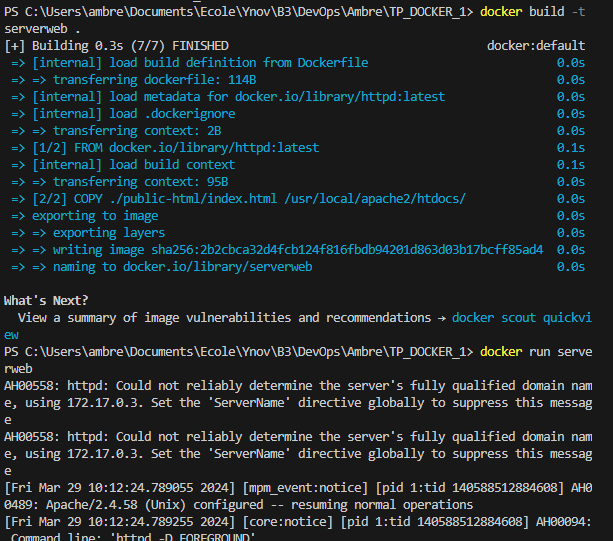

3.  
  
  
    a. docker pull httpd  
      

    b. docker images
      
  
    c.   
  
    d. docker run -d -p 3000:80 --name mondocker -v ./  public-html:/usr/local/apache2/htdocs/ httpd   
      
  
    e. docker stop mondocker  
    docker rm mondocker  
      
  
    f. docker run -d -p 3000:80 --name mondocker httpd   
      
    docker cp ./public-html mondocker:/usr/local/apache2/htdocs/  
      
  
3.  
  
  a. echo >> "Dockerfile" ou clique droit  

  b. docker build -t serverweb .  
    
  
  c. La méthode de la question 4 est mieux pour créer les images  
  Q3 points forts/faibles :  
  - beaucoup de commandes  
  - moins bien  
    

  Q4 points forts/faibles :  
  + mettre dans un fichier c'est mieux pour y accéder  
  + c'est mieux, j'ai mieux compris  

5.  
  
  a. docker pull mariadb  
  docker pull phpmyadmin  
  
  b.docker run -d -p 8080:80 mariadb  
  docker run -d -p 8080:80 phpmyadmin  
    
  
    
  Je n'arrive pas a me connecter    
    
6.  
  
  a. Docker compose permet de lancer plusieurs container. Elle permet de les créer et de les lancer tout les services que l'on souhaite et elle peut donner pleins d'informations sur les services. Tandis que docker run ne permet d'agir que sur un seul container a la fois.  
  
  b. docker compose up  
  docker compose down  
  
  c. docker compose up -d  
    
