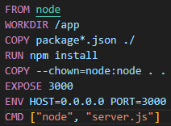
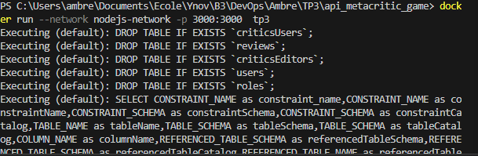
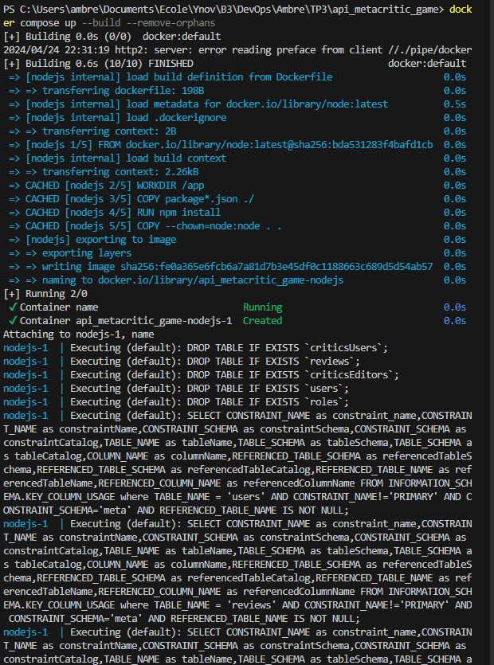

2.  

3. docker network create nodejs-network
docker run --network nodejs-network -e MYSQL_ROOT_PASSWORD=passwd -e MYSQL_DATABASE=meta --name nodejs-mysql -d mysql

3/4. docker build -t tp3 .

3/4. docker run --network nodejs-network -p 3000:3000  tp3

5. docker compose up --build

Questions :

1. Ca met une erreur car on ne peut pas utiliser 2 fois le même port
2. npm install --production
2bis. Afin d'utiliser seulement les dépendances nécessaires pour l'exécution, ca permet d'enlever les dépendances de développement
3. Docker scan pour les images
4. Si on laisse "localhost" dans le container node, il va contacter le localhost de son container mais pas celui de mon pc. Il faut donc le changer pour que les 2 containers soient sur le même network. Il faut donc utiliser le nom du container et plus le localhost dans db.config.js (pour moi).
