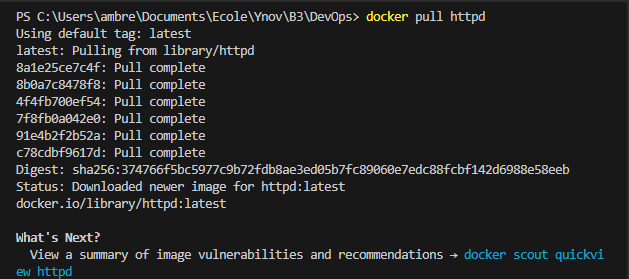
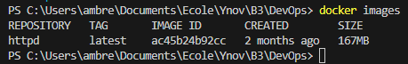
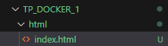
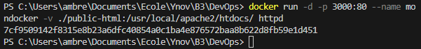
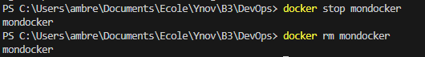
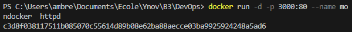
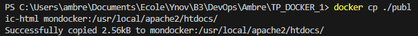

3.  
  
    a. docker pull httpd  
      
  
      
  
    c.   
  
    d. docker run -d -p 3000:80 --name mondocker -v ./  public-html:/usr/local/apache2/htdocs/ httpd   
      
  
    e. docker stop mondocker  
    docker rm mondocker  
      
  
    f. docker run -d -p 3000:80 --name mondocker httpd   
      
    docker cp ./public-html mondocker:/usr/local/apache2/htdocs/  
      
  
4.  
  
  a. echo >> "Dockerfile" ou clique droit  

  b. 